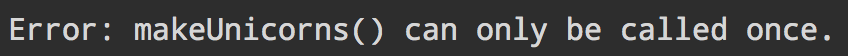

# onetime [](https://travis-ci.org/sindresorhus/onetime)

> Only call a function once

When called multiple times it will return the return value from the first call.

*Unlike the module [once](https://github.com/isaacs/once), this one isn't naughty extending `Function.prototype`.*


## Install

Download [manually](https://github.com/sindresorhus/onetime/releases) or with a package-manager.

```bash
$ npm install --save onetime
```

```bash
$ bower install --save onetime
```

```bash
$ component install sindresorhus/onetime
```


## Usage

##### Node.js

```js
var onetime = require('onetime');
```

##### Bower

```html
<script src="bower_components/onetime/onetime.js"></script>
```

##### Usage

```js
var i = 0;
var foo = onetime(function () {
	return i++;
});

foo(); //=> 0
foo(); //=> 0
foo(); //=> 0
```


## API

### onetime(function, [shouldThrow])

#### function

Type: `Function`

Function that should only be called once.

#### shouldThrow

Type: `Boolean`  
Default: `false`



Set to `true` if you want it to fail with a nice and descriptive error when called more than once.


## License

[MIT](http://opensource.org/licenses/MIT) © [Sindre Sorhus](http://sindresorhus.com)
